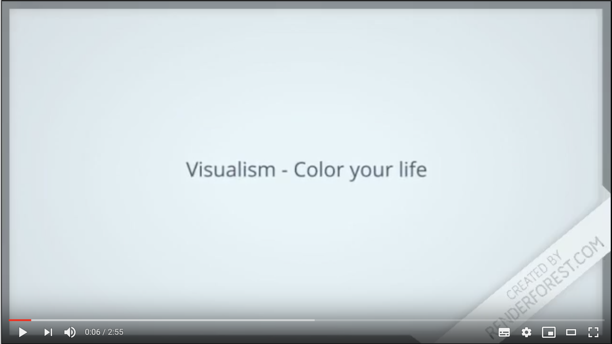
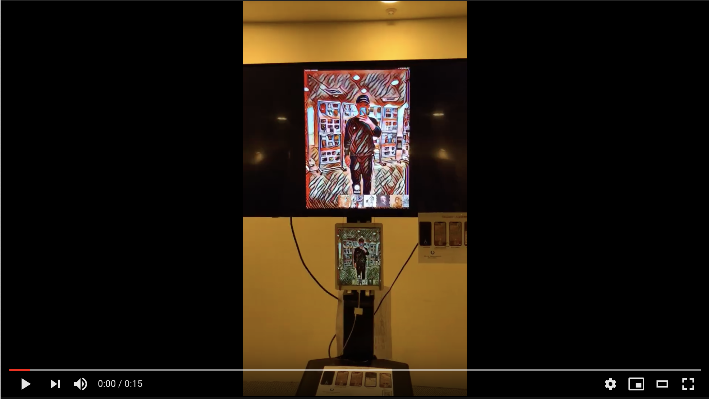
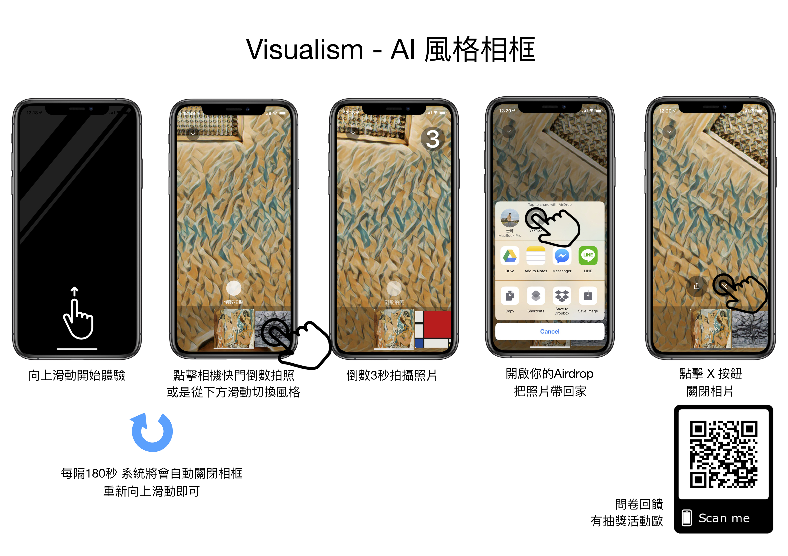

# Visualism - Color Your Life

## Conception:
This is a Real Time Style Transfer App using CoreML. we cooperated with Taiwan National Palace Museum, build a learning model which stylize user's picture in real time using deep learning technique.

## Stylize Samples:

## Demo Video:
* User can stand in front of camera and stylize image will show up on the big screen.

* Function Demo

## Poster

## Reference
* [Perceptual Losses for Real-Time Style Transfer
and Super-Resolution](https://cs.stanford.edu/people/jcjohns/papers/eccv16/JohnsonECCV16.pdf?fbclid=IwAR1K9Igv7KPMefKZoZy9S8xr2QCnyO2V1Dlh0qkdV413Fh0t4BAvZYN6qU4)
